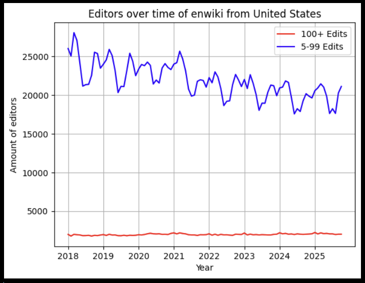
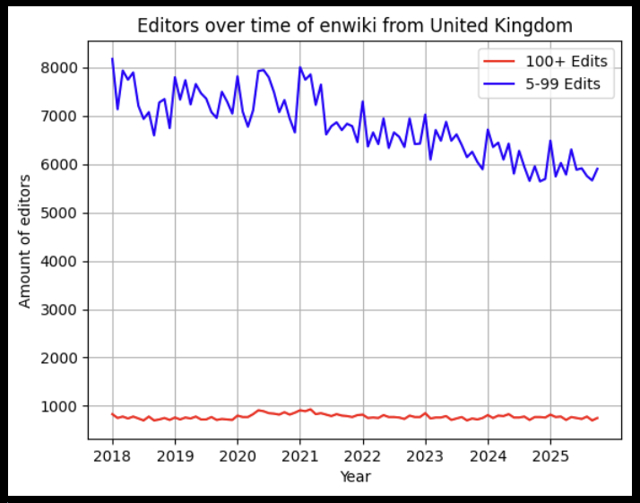
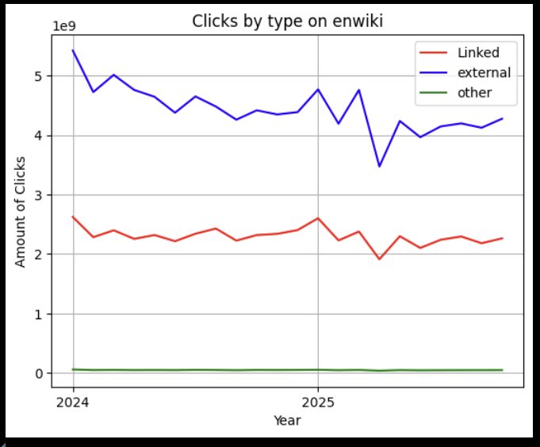
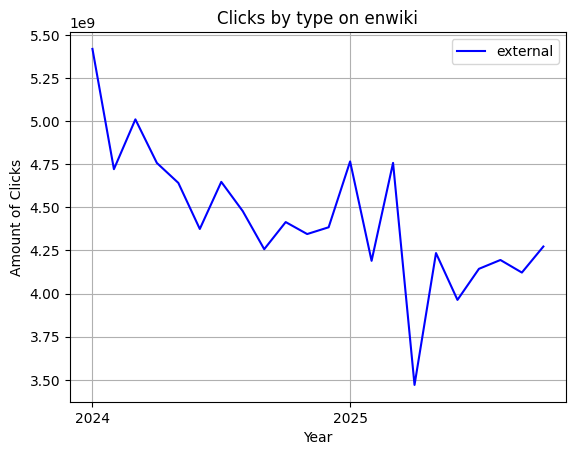
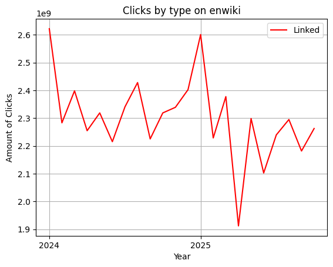
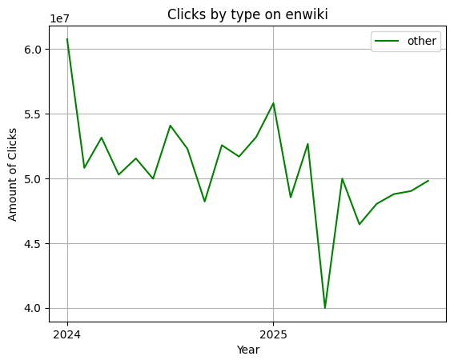

## Dataset Selection

### Chosen Datasets:

The current datasets I am choosing to work with comes from https://dumps.wikimedia.org/, specifically Clickstreams of EnWiki at: https://dumps.wikimedia.org/other/clickstream/readme.html focused on EnWiki entries and https://dumps.wikimedia.org/other/geoeditors/readme.html. I will probably work on incorporating other datasets wth this, but I am having trouble due to the immense size of some of these datasets and my personal hardware. My current hope is to use this in some way to gain an understanding of bot traffic or look for unusual patterns that could indicate suspicious behavior. All of these datasets are made freely available by the organizers of Wikipedia. 

### Structure and Relevance

For the clickstream dataset, the documentation on the website says that it follows the structure of: (previous site, site that was clicked to, type of referral\*, number of clicks matching that description). Type of referral can be one of three possible values: link (meaning it was clicked through from another Wikipedia article), external (clicked through from an external web page, search engine, or like), and other (referrer is another Wikipedia article, but no link that fits that description is on that page or from a Wikipedia search). Something that I found of interest on the webpage for this is: 
>A note on empty referrers. There's a [discussion on Phabricator](https://phabricator.wikimedia.org/T195880) that broadly suspects unidentified bots and browser bugs to be the main culprits, with fantastic deeper dives that look at VPNs, Wikipedia being set as the home page, and switching from mobile apps to mobile browsers when clicking on Wikipedia links. Definitely worth a read. And some further reading on [Groupon's experiment](https://searchengineland.com/60-direct-traffic-actually-seo-195415), that finds a high percentage of Direct and Organic search traffic. 

I'll definitely be reading into these to find more ideas and information about how to interpret the data.

For the geoeditors dataset, it is structured in the format of (wikidb, country, activity level, lower bound, upper bound). The wikidb field is for what Wikipedia database is being accessed, for example the english speaking Wikipedia is enwiki. Country is the origin of the editors for the entry. Activity level classifies users by how many edits they made that month, if the editor makes more than 100 edits in that month they get classified into 'more than 100' or if they make between 5 and 99 edits they get classified into '5 to 99'. In my own cleaning of the data I have made this into a boolean variable. The final two columns of the dataset give ranges of how many people would fall into each group, not exact numers to protect user privacy. Sadly, this dataset has had suspected bot traffic removed, but I still believe it could be a valuable asset for baseline activity on the databases.

The relevance of these datasets to the study of detecting malicious or unusual traffic is very useful. I am theorizing using clickstream data to try and find places with unusual or unlikely spikes either from specific articles or to specific articles. I believe that by studying these in combination with other data there may be a way to start classifying what articles or Wikis get targeted by bot traffic. From there I might be able to start inferring what people running these bots think are important.

## EDA

My EDA was not as successful as I had hoped it would be, mainly due to how large these dataset are. The Geoeditors datasets are extremely aggregated and I had no issue downloading and analyzing those. The combined parquet file for the period 2018 to present ended up being `644 KB` in total. In some of my EDA of that database I was exploring the EnWiki, which I think I will focus on. Some of the initial graphs from EDA looked like this:

More of my issues lay in the clickstream data, where one month would usually uncompress to more than `1.5 GB` for a total directory size of about `17 GB`. This made it not possible (at least in any way I've found yet) to combine these into a single file and do queries based off of specific parts of the entire dataset. I was also limited to only getting the current and past year of data, due to storage issues, though I am working on remedying that. I did manage to make some graphs which I found interesting:

I find that most of the shapes of these graphs being similar indicative of human nature, though I am interested in studying discrepancies in those and trying to discover what could have caused larger spikes in some types of clicks vs. others.

Some features that I might be planning on using is proportionate data of click types for specific resources, either referring or recieving. I might also work on a way to be able to compare that to the editors over time to see if there are correlations in spikes of editors to spikes in views of articles. This would mainly be a classification project to find unusual traffic.