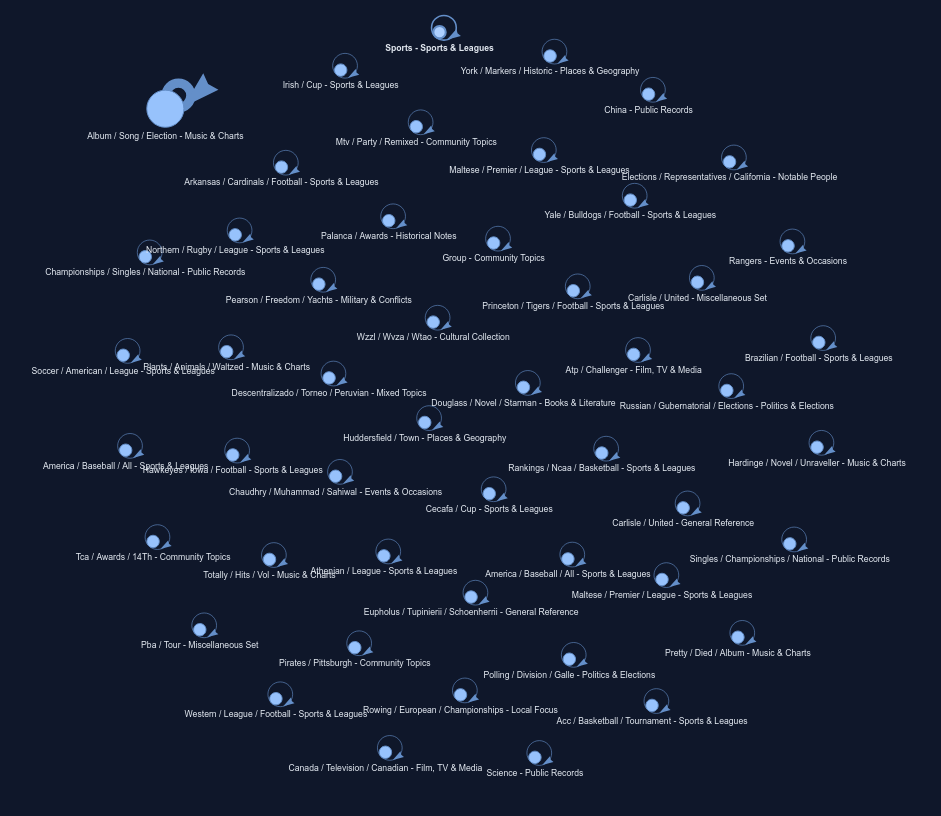
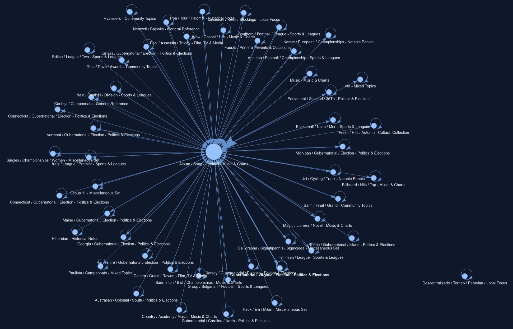

The one parameter that I can easily change in the model is resolution_parameter in the Leiden Group finding model. From this I have gotten some pretty interesting results. At first, I did not understand the data and tried to make the groups larger and larger by adjusting this parameter, but I seemed to be hitting a limit. It wasn't until I visualized the data that I realized there were no edges between lots of these smaller communities. You can see this in this picture:

This is with the parameter set to the maximum smallest value (increases group sizes) that my machine could handle. As you can see there is the massive group in the top left and all the other groups are much smaller. Also note that there are no edges between the groups. Then comparing this to a larger value (decreases group size) I got this result:

As you can see in this graphing, there are edges between the largest group and all of the other groups, except for one. This means that the partitioning algorithm is acutally splitting up interconnected networks, and not purely relying on the fact that there is an air gap, like with the other groups.

Something that I would like to try for the final project is getting rid of any of the smaller groups that have no connection with the main large group. I believe that this would lead to more interesting results, since it would push the model to make more partitions based on the actual interconnectedness of the data, rather than the air gaps present in the communities on the outer edges. I am still debating about including type 'other' (any link which is unusual, for example searching for an article rather than clicking it on the Wikipedia page). One more fascinating thing I found is that gubernatorial elections (elections of governers) by state group together really easily. Not sure what to do with this observation, but it's fascinating nonetheless. 